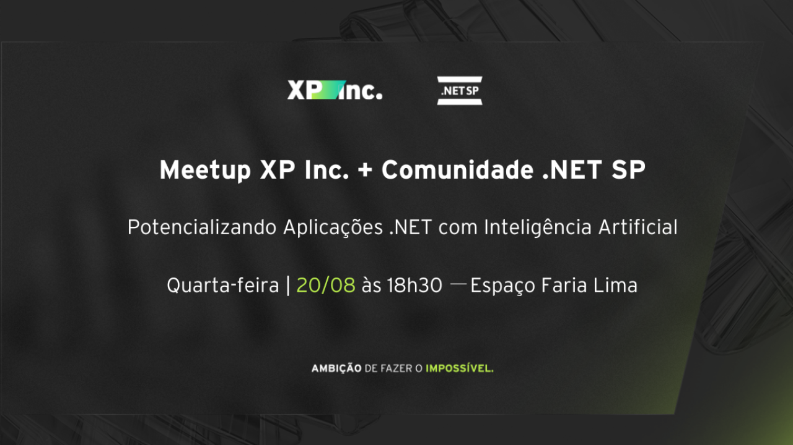
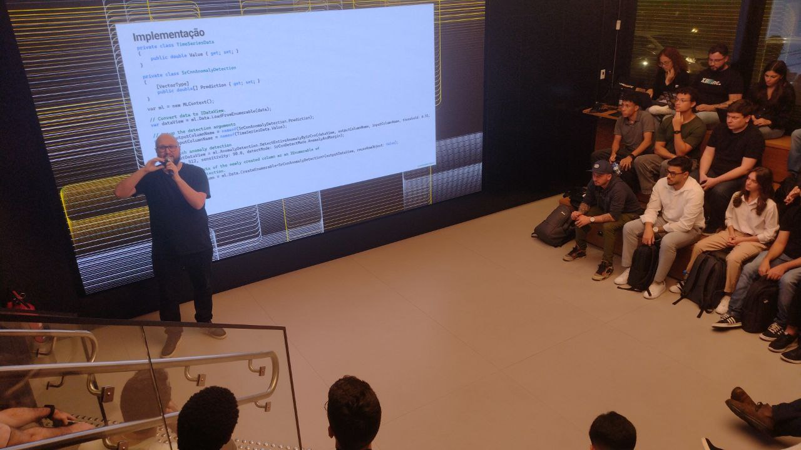
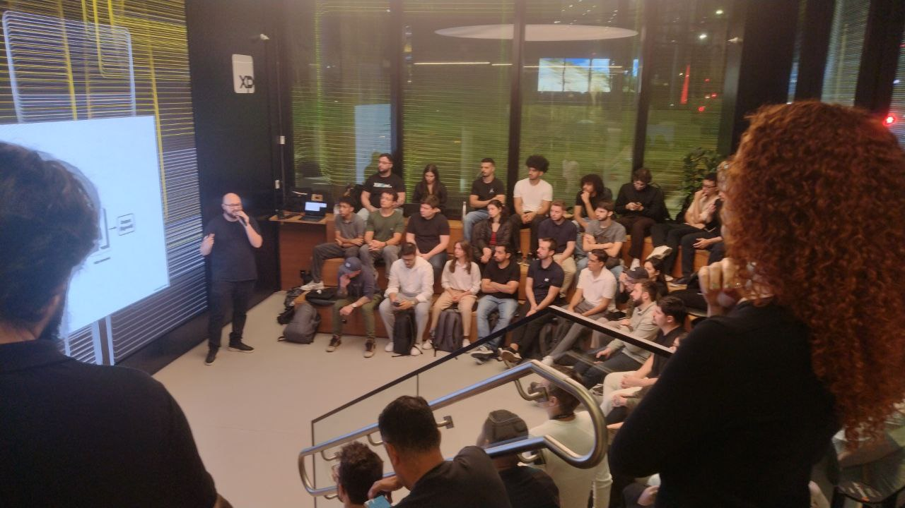
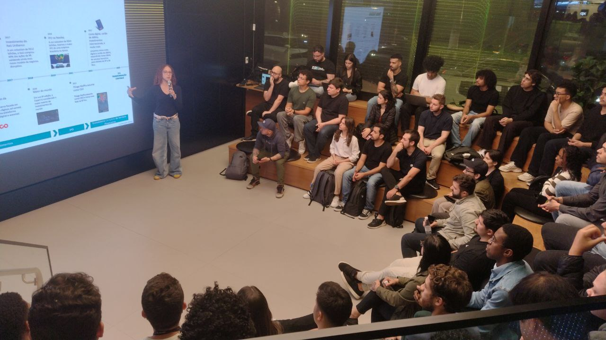
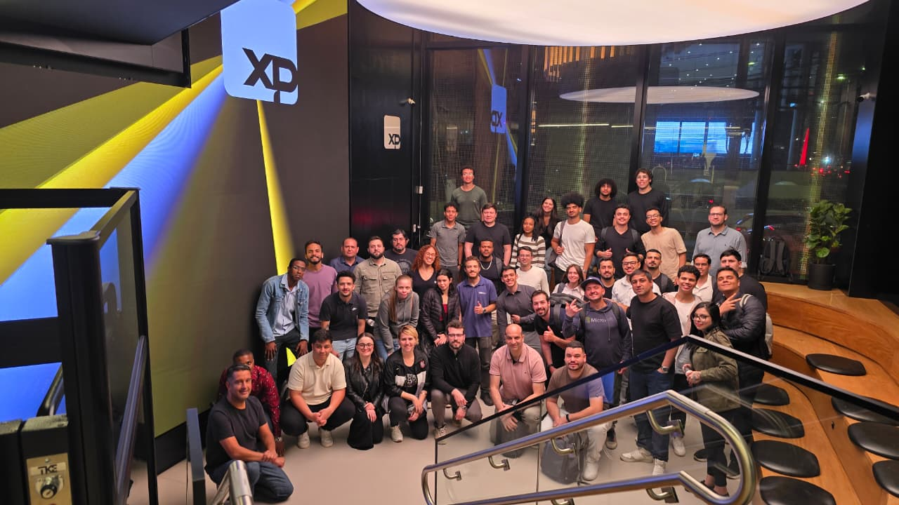

# dotnet-ia-xp-sp-2025-08
**Potencializando Aplicações .NET com Inteligência Artificial** - um evento presencial e gratuito realizado em parceria entre a comunidade .NET São Paulo e a XP Inc.

Data: **20/08/2025 (quarta-feira)**

Organizadores:
- **Julia Martins Ferreira (XP Inc.)**
- **Renato Groffe (Microsoft MVP, Docker Captain, MTAC)**
- **Milton Camara Gomes (Microsoft MVP, MTAC)**

Número de participantes: **50 pessoas**

---

Apresentações/talks que aconteceram durante o evento:

_# ML.NET: usos e aplicabilidades para Machine Learning_

Palestrante: **Gustavo Romano (Sócio e Staff Software Engineer da XP Inc.)**

Tecnologias e tópicos abordados: **.NET, ML.NET, TensorFlow, Machine Learning, Inteligência Artificial, Microsoft Azure...**

_# .NET + MCP: integrando com facilidade soluções de Inteligência Artificial a suas aplicações!_

Palestrantes: **Renato Groffe (Microsoft MVP, Docker Captain, APIsec U Ambassador, MTAC)** e **Milton Camara Gomes (Microsoft MVP, MTAC)**

Tecnologias e tópicos abordados: **.NET 9, C#, MCP, NuGet, Inteligência Artificial, Visual Studio Code, SQL Server, Docker, Docker Compose, Docker MCP Catalog, OpenTelemetry...**

---

Acesse este [**link**](/img/) para visualizar todas as fotos das apresentações.

Este evento foi uma parceria entre a comunidade [**.NET SP**](https://www.meetup.com/dotnet-Sao-Paulo/) e a [**XP Inc.**](https://www.linkedin.com/company/xpinc/).

Formulário utilizado para inscrições: [**Sympla**](https://www.sympla.com.br/evento/potencializando-aplicacoes-net-com-inteligencia-artificial-gratuito-e-presencial-sao-paulo-sp/3072488)

Divulgação em redes sociais: [**LinkedIn**](https://www.linkedin.com/events/meetupxpinc-comunidade-netsp7361045010080751619/)

Local: **XP Espaço Faria Lima - Rua Avenida Brigadeiro Faria Lima, 3320 - Itaim Bibi - São Paulo-SP - CEP 04538-132**

Deixamos aqui nossos agradecimentos à **Julia Martins Ferreira (XP Inc.)** pela oportunidade e todo o apoio para promovermos este evento

---

